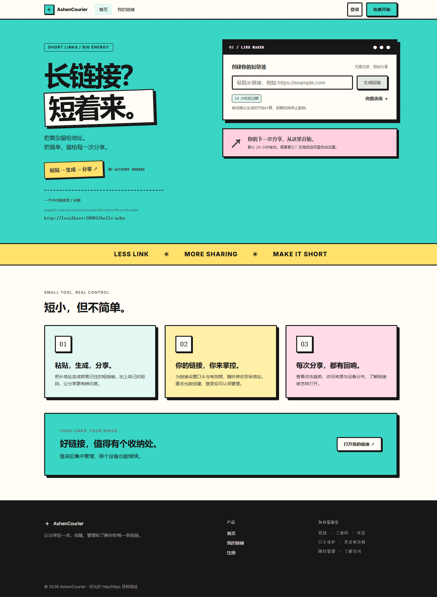

# AshenCourier

把长链接变短，集中管理分享。Vue 3 / TypeScript / Tailwind v4 前端，Go 1.27 API，PostgreSQL 18 和 Redis 8，Docker Compose 部署。



## 能力

- 匿名创建、自定义短码、标签、有效期和访问口令；登录后可认领匿名链接。
- 网页生成默认 24 小时过期（从提交时起算），可选 1 小时、7 天、30 天、永久或自定义时间。已有短链不变；直接 API 调用不传 expires_at 仍保持原有永久有效约定。
- 编辑、停用和软删除；短码全局唯一，不复用已删除短码。
- 二维码展示与 PNG 下载、公开 SVG 二维码接口。
- 点击趋势、来源、设备、浏览器和可选 GeoIP 国家分布；明细 API 只显示 IP 网段。
- 初音青绿 Neo-brutalism 界面，支持移动端、键盘导航、焦点管理和错误重试。

## 启动

```sh
cp .env.example .env
# 填写 POSTGRES_PASSWORD、REDIS_PASSWORD、JWT_SECRET
docker compose -f docker-compose.yml up -d --build
```

打开 http://localhost:8080。默认只绑定宿主回环；PUBLIC_BASE_URL 必须与访问入口匹配。数据库密码含 URL 保留字符时，需要编码 DATABASE_URL 中的密码部分。

线上目标是 https://shorten.miku831.fun/，链路为 Cloudflare → 1Panel OpenResty → frontend 容器。完整步骤见 [1Panel 部署与回滚](docs/DEPLOY-1PANEL.md)，不要直接将本地配置原样用于生产。

## 架构与一致性

浏览器通过同源 `/api` 请求 API，`/{code}` 由 Go 处理跳转，其他页面由 Nginx 托管 SPA。跳转不会同步写 PostgreSQL；点击进入有界内存队列，再进入 Redis 计数与 Stream，worker 异步写入。

计数回刷采用固定批次：Redis 原子冻结 → PostgreSQL 事务登记批次并累加 → Redis 按批次 ID 确认。重复投递和多个 worker 不会重复累加同一批。查询通过 Redis 代际快照和数据库批次提交记录避免重复展示。Redis 不可读时退回数据库基线。

这不是每次请求都精确计数的保证：队列满、Redis 故障、持久化数据丢失仍可能少计。历史计数不自动校正。`link_click_totals` 分别提供 `base_count` 与 `event_count` 供对账，并非两者相加。

访问口令只在数据库存 bcrypt 摘要；缓存保存保护标志和版本。更换或清除口令会递增版本，旧解锁 cookie 不再有效。匿名管理密钥只在创建响应中返回，数据库只存摘要，浏览器保存用于再次管理；存储不可用时仅当前页面会话有效，应另行保存密钥。

## 接口

| 方法 | 路径 | 用途 |
| --- | --- | --- |
| POST | `/api/auth/register`、`/api/auth/login` | 账号与登录 |
| GET | `/api/auth/me` | 当前用户 |
| POST / GET | `/api/links` | 创建 / 我的链接列表 |
| GET / PATCH / DELETE | `/api/links/{code}` | 查询 / 编辑 / 软删除 |
| POST | `/api/links/{code}/claim` | 使用管理密钥认领 |
| GET | `/api/links/{code}/stats`、`clicks` | 聚合 / 明细 |
| GET | `/api/links/{code}/qr.svg` | 公开二维码 |
| GET / POST | `/{code}` | 跳转或口令页 / 提交口令 |
| GET | `/healthz` | 公开精简健康状态 |

鉴权使用 Bearer token 或 `X-Manage-Key`。携带失效令牌会得到 401，不再静默降为匿名创建。错误体为 `{ "error": { "code", "message", "field", "request_id" } }`。列表与明细采用游标分页。

自定义域名目前由运维登记到 domains 表，无管理 API、无自动 DNS 验证，也没有 is_active 列；单域名部署无需登记该表。不要把历史工作笔记当作当前 schema。

## 开发与验证

```sh
cd frontend
pnpm install --frozen-lockfile
pnpm dev
pnpm test
pnpm typecheck
pnpm lint
pnpm audit:refs
pnpm build
```

后端在 backend 目录执行 `go test ./...` 和 `go vet ./...`。Linux 可执行 `go test -race -count=1 ./...`。真实存储测试需要 `POSTGRES_TEST_DSN`（库名必须以 `_test` 结尾）、`REDIS_TEST_ADDR`、`REDIS_TEST_PASSWORD` 与独立 `REDIS_TEST_DB`；不提供时相关用例跳过。

```sh
node frontend/e2e/browser-check.mjs --base http://localhost:18083
node frontend/e2e/redesign-check.mjs http://localhost:18083
cd backend
go run ./cmd/smoke -base http://localhost:18083 -expect-spa
```

浏览器检查需要本机 Chrome，可用 CHROME_BIN 指定路径。冒烟会消耗创建限流配额，放在浏览器检查之后运行，不要对生产数据执行。

- [设计规范](DESIGN.md)
- [审计与验证记录](docs/AUDIT-2026-10-02.md)
- [部署、备份、升级与回滚](docs/DEPLOY-1PANEL.md)

仓库中的 PLAN、RESUME、INTERVIEW、AUDIT-TDD 和 .workbuddy 内容属于历史过程记录；当前行为以源码、测试和上述文档为准。
